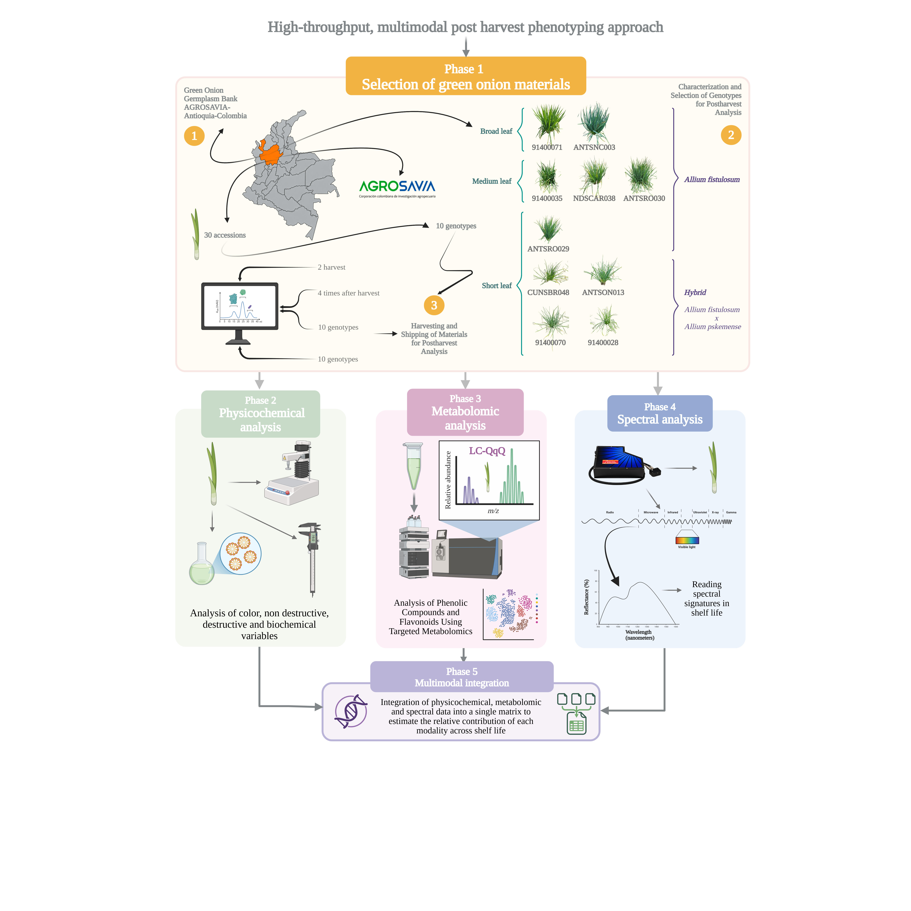

# High-throughput postharvest phenotyping of green onion germplasm quality

[](https://www.python.org/)
[](https://cran.r-project.org/package=ARTool)
[](https://www.metaboanalyst.ca/)

Data and analysis code for the study *High-throughput postharvest phenotyping discriminates green onion (Allium spp.) germplasm through multidimensional quality traits* (Castaño-Tarazona, Henao-Rojas, Melgarejo, Cala & Ramírez-Gil).

---

## Overview

Green onion (*Allium fistulosum* L.) is one of the most important vegetable crops in the Colombian high tropics, but there are no systematic methods to measure its postharvest quality or to find the genotypes that keep that quality longest.

This repository implements a **multimodal high-throughput postharvest phenotyping (HTPP)** approach. Ten genotypes from two species (*A. fistulosum* and a Hybrid) were followed across **two harvests** and **four storage times** (2, 6, 10 and 14 days after harvest, DAH), combining physicochemical, metabolomic and spectral data.

## Methodological framework



*Figure 1 from the article.* The approach runs in five sequential phases:

| Phase | What it does |
|---|---|
| **1. Selection of materials** | 30 accessions from the AGROSAVIA germplasm bank (Antioquia, Colombia) were reduced to 10 contrasting genotypes using morphology, preliminary physicochemical data and multivariate analysis (PCA, k-means, PLS-DA). |
| **2. Physicochemical analysis** | Color, morphology, fresh weight, chlorophyll (SPAD), respiration, firmness, soluble solids, titratable acidity, moisture and pyruvic acid. Analyzed with ART ANOVA and kinetic models selected by AICc. |
| **3. Metabolomic analysis** | Targeted LC-MS/MS (QqQ) profiling of phenolic compounds and flavonoids at 2 and 14 DAH, analyzed in MetaboAnalyst 6.0. |
| **4. Spectral analysis** | Pseudostem reflectance signatures (350–1400 nm, 1051 bands), ComBat batch correction, XGBoost classification and SHAP band selection. |
| **5. Multimodal integration** | The three data blocks are joined into one block-scaled matrix (PCA, PLS-DA, VIP, correlation network) to estimate how much each modality contributes over shelf life. |

### Genotypes evaluated

| Species | Genotypes |
|---|---|
| *A. fistulosum* | 91400071, ANTSNC003, 91400035, NDSCAR038, ANTSRO030, ANTSRO029 |
| Hybrid | CUNSBR048, ANTSON013, 91400070, 91400028 |

## Repository structure

| File | Phase | Description |
|---|---|---|
| [Phase_1_Phenotyping_PEAS_validation).ipynb](Phase_1_Phenotyping_PEAS_validation%29.ipynb) | 1 | Multivariate selection and validation of the 10 genotypes |
| [Phase_2_Physicochemical_analysis.ipynb](Phase_2_Physicochemical_analysis.ipynb) | 2 | ART ANOVA, kinetic models, reference thresholds and stability index |
| [Phase_4_XGBoost_Models_Spectral_Clasification.ipynb](Phase_4_XGBoost_Models_Spectral_Clasification.ipynb) | 4 | Spectral preprocessing, XGBoost / LogReg L1 classification and SHAP |
| [Phase_5_Multivariate_analysis.ipynb](Phase_5_Multivariate_analysis.ipynb) | 5 | Integrated PCA, PLS-DA, PERMANOVA and cross-modality network |
| [Onion_Postharvest_Results_Summary.md](Onion_Postharvest_Results_Summary.md) | 2 | ART ANOVA and kinetics results in one page |
| [Spectral_Model_Metrics_Summary.md](Spectral_Model_Metrics_Summary.md) | 4 | Classification metrics for all spectral models |

> Phase 3 (metabolomics) was processed in Agilent MassHunter and MetaboAnalyst 6.0, so it has no notebook.

> **Data availability:** the input data (`data/` folder) are not public yet and will be released in this repository upon publication of the article.

## Key findings

- **Deterioration is simultaneous and species-dependent.** The Hybrid crossed the chlorophyll, fresh weight and moisture thresholds earlier than *A. fistulosum*.
- **Most stable genotypes:** ANTSRO030, ANTSNC003 and ANTSRO029 (*A. fistulosum*) and 91400028 (Hybrid). The three *A. fistulosum* genotypes come from only two municipalities in Antioquia (Santa Rosa de Osos and San Cristóbal).
- **Metabolic plasticity:** the Hybrid reorganized its phenolic and flavonoid profile between 2 and 14 DAH, while *A. fistulosum* stayed stable.
- **Spectral discrimination between species is non-monotonic:** 85.0 % accuracy at 2 DAH, 60.0 % at 6 DAH, 80.0 % at 10 DAH and 84.2 % at 14 DAH. Spectra could not separate individual genotypes.
- **Integration shows the role of each modality over time:** the spectral block weighs most at 2 DAH (42 %), the metabolomic block at 14 DAH (48 %), and the physicochemical block links the other two.

## Running the code

1. Clone the repository:
   ```bash
   git clone https://github.com/agrocompepidemlab/High-throughput-postharvest-phenotyping-of-green-onion-germplasm-quality.git
   ```
2. Install the main Python dependencies:
   ```bash
   pip install pandas numpy scipy scikit-learn matplotlib seaborn xgboost shap neuroCombat networkx openpyxl
   ```
3. Open the notebooks in Jupyter, VS Code or Google Colab and run them in order. The ART ANOVA cells require R with the `ARTool` package.

## Citation

If you use these data or code, please cite the article:

> Castaño-Tarazona, L. W., Henao-Rojas, J. C., Melgarejo, L. M., Cala, M. P., & Ramírez-Gil, J. G. High-throughput postharvest phenotyping discriminates green onion (*Allium* spp.) germplasm through multidimensional quality traits.

## Funding and acknowledgments

Funded by the Sistema General de Regalías (SGR) of Minciencias Colombia through the project *"Mejoramiento del sistema productivo de cebolla de rama enfocado a las demandas del mercado en fresco y/o agroindustria en el departamento de Antioquia"* (BPIN 2020000100413).

We thank AGROSAVIA, Universidad Nacional de Colombia and MetCore (Universidad de los Andes) for their institutional and technical support.

## Contact

- Leslie Walessa Castaño-Tarazona — lcastano@unal.edu.co · [ORCID](https://orcid.org/0009-0009-9874-4633)
- Juan Camilo Henao-Rojas — AGROSAVIA · [ORCID](https://orcid.org/0000-0003-0007-6809)
- Joaquín Guillermo Ramírez-Gil (corresponding author) — jgramireg@unal.edu.co · [ORCID](https://orcid.org/0000-0002-0162-3598)

**Laboratorio de Agrocomputación y Análisis Epidemiológico**, Universidad Nacional de Colombia, Bogotá.
